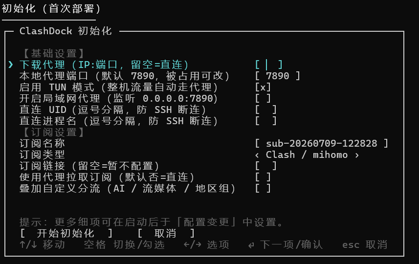
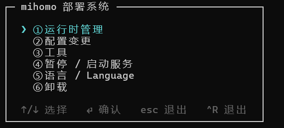
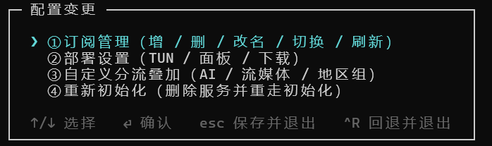
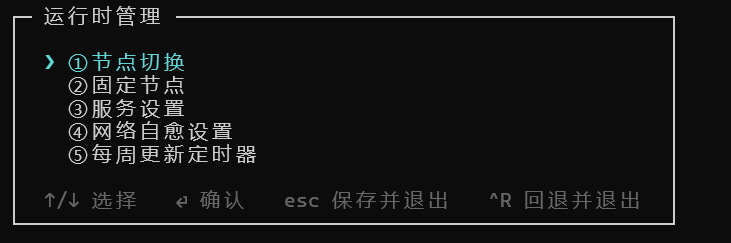
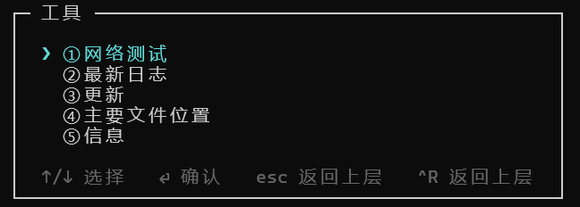
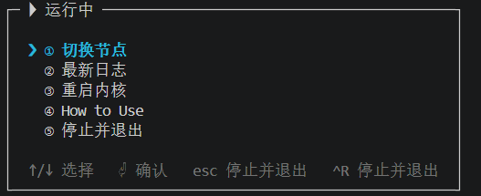

# clashdock

在 Linux 上交互式部署 / 管理 **mihomo（Clash.Meta）** 的终端应用。单个静态二进制，
全流程交互完成：**初始化 / 更改配置 / 暂停启动 / 网络测试 / 卸载**。
> 如果想体验 sing-box 内核，可以参考 [sboxkit](https://github.com/Trilives/sboxkit)

- **直用机场订阅**：mihomo 原生吃 Clash 配置，clashdock **直接消费机场的 Clash/mihomo
  订阅**，只最小改写部署必需字段（端口 / 局域网 / 外部控制器 / TUN / 面板），机场自带的
  策略组与分流规则**全部保留**。自定义分流为**可选叠加**，默认不启用。
- **开箱即用**：.deb 包内置 mihomo 内核与基础规则文件（geosite + IP 库），
  安装后**离线即可启动**；更大的规则数据（geoip.metadb 等）可稍后在线更新。
- **单文件零依赖**：Go 编译的静态二进制，不需要 python3 / curl / 任何运行时。
- **自更新**：主菜单一键把 clashdock 自身更新到最新发行版（校验 SHA-256、原子
  切换版本、失败自动回滚），无需重新走一遍 .deb 安装；稳定版 / 预览版双渠道可选，
  切到预览版后可一键回退到上一个稳定版。
- **TUI 交互**：方向键导航、反显高亮、长提示语自动换行；非 TTY（管道/脚本）
  自动回退编号菜单。
- **随时可中止可回退**：配置类改动包在事务里，**esc 保存退出、^R 回退退出**，
  已应用的改动自动回滚。
- **按需提权**：普通用户启动，需要 root 时自动 `sudo`；也提供**免 root 的便携模式**
  （见「安装 · 便携/轻量模式」）。

## 预览

首次运行（或检测到服务尚未注册）会先选择语言，再询问是否现在进行初始化；主菜单默认
英文启动，可在「Language / 语言」里切成中文（部分终端无法正常显示中文字符）。初始化用
单屏表单一次性收集基础设置与首个订阅，字段随选择动态显隐。

| 初始化 | 主菜单 |
|:---:|:---:|
|  |  |
| **配置变更** | **运行时管理** |
|  |  |
| **工具** | **便携模式** |
|  |  |

- **配置变更**：订阅管理（增/删/改名/切换/刷新，切换/刷新自动同步并重启服务）、部署设置
  与自定义分流叠加（AI / 流媒体 / 地区组）——两个定制层字段分组直接是平级项。
- **运行时管理**：节点切换 / 固定节点 / 服务设置 / 网络自愈 / 更新定时器，均为即时生效的
  系统操作，各自按需处理重启。
- **工具**：网络测试、最新日志、更新、主要文件位置、信息（代理端口/局域网可达性/TUN/面板
  地址一览）。
- **便携模式**：免安装、免 root 原地直接跑，前台监护内核，退出即停。

方向键上下移动、⏎ 确认、esc 保存返回、^R 回退返回；每层菜单重入时光标停在上次选中项；
长提示语按终端宽度自动换行；非 TTY（管道/重定向）下自动回退为编号列表 + 文本输入。菜单
选项按常用程度排列（日常操作在前，卸载这类低频/破坏性操作放最后）。

## 安装

### 方式一：.deb（推荐，内置离线种子）

从 [Releases](https://github.com/Trilives/clashdock/releases) 下载对应架构的包，同目录下运行：

```bash
sudo dpkg -i clashdock_*_linux_amd64.deb   # 或 arm64 / armv7
# 也可以使用 sudo apt install ./clashdock_*_linux_amd64.deb
clashdock
```

.deb 内含：`/usr/bin/clashdock`、mihomo 内核（`/usr/libexec/clashdock/mihomo`）、
基础规则种子（`/usr/share/clashdock/ruleset/`）。首次初始化会自动接管这些种子，
无需联网即可注册并启动服务。第三方资产的许可与归属见
`/usr/share/doc/clashdock/copyright`。

### 方式二：tar.gz 便携包（内置离线种子，自安装脚本）

便携包同样自带 mihomo 内核与基础规则；`install.sh` 把它们连同本体二进制装入与
`.deb` **完全一致**的系统路径，效果等同 `sudo apt install clashdock_*.deb`，
装完离线即可初始化（初始化阶段不下载内核）：

```bash
tar -xzf clashdock_*_linux_amd64.tar.gz    # 或 arm64 / armv7
cd clashdock_*_linux_amd64
sudo ./install.sh     # 装入 /usr/bin、/usr/libexec/clashdock、/usr/share/clashdock
clashdock
```

卸载系统文件：`sudo ./uninstall.sh`（不动 `/var/lib/clashdock` 状态数据）。

### 方式三：便携/轻量模式（免安装、免 root、原地直接跑）

面向**拿不到 root** 的环境（实验室 / 机房 / 受管终端等）：不装服务、不改系统路径、
不提权，解压即用、整包可移动/删除。从便携包目录启动会自动进入便携模式（也可显式
`./clashdock run`）：

```bash
tar -xzf clashdock_*_linux_amd64.tar.gz
cd clashdock_*_linux_amd64
./clashdock            # 轻量模式：不装服务、不改系统、不需 root
```

clashdock 停在前台充当监护进程：在**可执行文件所在目录**旁建 `clashdock-data` 工作目录
（整包自包含，不随启动位置变化；只读位置回退当前目录）→ 引导添加订阅 → 用便携包自带的
内核直接启动（纯代理，本机 `127.0.0.1:7890`）。菜单可切换节点 / 看日志 / 重启 /
How to Use / 停止退出；**退出 clashdock 内核随之停止**（不留后台进程）。

便携包自带 `tool/` 目录，两个脚本**只改解压目录、无需 root**：

```bash
./tool/update.sh      # 交互式更新 clashdock 本体 / mihomo 内核 / 规则集
./tool/nettest.sh     # 测试直连与本机代理的连通性、时延和出口 IP
```

便携包**不含 Web UI**（面板）；需要图形面板请用完整版（`install.sh` 装成服务后由 mihomo
内置 `:9090/ui/` 提供）或在线面板。需要开机自启 / TUN / 局域网代理等完整能力时，改用
上面的 `install.sh`。

### 方式四：源码构建

```bash
git clone https://github.com/Trilives/clashdock.git && cd clashdock
make build && ./clashdock
```

## 使用

**推荐方式：直接运行 `clashdock` 进入交互式终端**——这正是本项目的特点：
部署、订阅、切节点、服务管理全部在方向键菜单里完成，esc 保存返回、^R 回退返回，
无需记忆任何命令。

```bash
clashdock
```

脚本化 / 无人值守场景另有一组子命令（`init` / `modify` / `nettest` /
`pause` / `resume` / `update` / `uninstall` 等），详见
[docs/COMMANDS.md](docs/COMMANDS.md)。

## 功能一览

| 功能 | 说明 |
|---|---|
| 订阅管理 | 多订阅增/删/改名/切换/刷新；添加订阅支持 clash / base64（经 subconverter）/ 本地 YAML 文件三种来源；另有「本地文件覆盖」直接改写当前生效配置（不建订阅条目） |
| 定制层 | 拆成「部署设置」与「自定义分流叠加」两个分组：TUN / 局域网代理 / LAN 面板 / 密钥（脱敏展示）/ 本地代理端口（默认 7890，可改）/ 下载代理 / GitHub 镜像与 Token / 强制直连端口（默认 22，规避出口封 SSH）/ 主选择组识别关键词（追加）等 |
| 节点切换 | 运行时管理提供「节点切换」与「固定节点」两个独立操作：前者仅 Clash API 热切换不写盘，后者写入配置并可选重启；均支持两级菜单（地区→节点）+ 并发实测延迟 |
| 地区聚合组 | 可选生成 SG-Auto / HK-Auto url-test 组，插入主选择组直接选用 |
| 自定义分流叠加 | 可选 AI / 流媒体 / 直连域名 / 直连端口规则叠加（默认关，直用机场分流） |
| clashdock 自更新 | 稳定版 / 预览版双渠道；下载发行版、校验 SHA-256、原子切换版本、试跑校验，失败自动回滚；切到预览版后可一键回退到上一个稳定版 |
| systemd 集成 | 主服务 + 网络自愈 watchdog + 每周更新定时器，统一暂停/启动；Web UI 走 mihomo 内置的 `:9090/ui/` 路径，不再单独占用端口 |
| 网络自愈 | NetworkManager 钩子 + watchdog：断网/漫游后自动恢复，防重启风暴 |
| 便携/轻量模式 | 免 root 原地运行纯代理，前台监护内核退出即停；自带 `tool/` 脚本（`update.sh` 就地更新本体/内核/规则、`nettest.sh` 网络自测），不含 Web UI |
| 工具 | 网络测试（流媒体/站点/AI 延迟 + OpenAI/Claude 出口 IP 落地）、最新日志（mihomo 服务日志 + clashdock 应用日志）、更新、主要文件位置一览、信息（代理端口/局域网可达性/TUN/面板地址与密钥状态） |
| 日志 | 可选写入 `<state>/clashdock.log`，超过体量上限自动裁剪保留最新内容 |
| 中英双语 | 默认英文启动（部分终端无法正常显示中文），首次运行检测到服务未注册时会先选语言，主菜单「Language / 语言」也可切中文，持久化到 `customize.json`；`CLASHDOCK_LANG=en\|zh` 可覆盖 |

## 数据目录

运行期所有数据使用**固定工作目录 `/var/lib/clashdock`**（不随用户 / HOME 变化，
root 运行的定时器与用户会话看到同一份数据；首次使用自动经 sudo 创建并交回属主）。
环境变量 `CLASHDOCK_HOME` 可覆盖（主要用于测试）。运行时自包含暂存于
`/var/lib/clashdock-runtime`，systemd 单元名沿用 `mihomo.service` 等。便携模式则把数据
放在便携包目录旁的 `clashdock-data`，整包自包含。

## 目录结构

```
clashdock/
├── cmd/clashdock/          # 入口：子命令分发 + TUI 主菜单
├── internal/
│   ├── tui/                # Bubble Tea 交互组件（select/multiselect/ask/confirm/form）
│   ├── flows/              # 初始化 / 配置变更 / 运行时管理 / 工具 / 卸载 / 节点切换 等流程
│   ├── i18n/               # 中英文界面文案（默认英文，源码中文原文即翻译表 key）
│   ├── subscription/       # 订阅：拉取 / 识别 / 最小改写 / 分流叠加 / 地区聚合组
│   ├── kernel/  fetchx/    # 内核·UI·geo 下载（直连优先→代理兜底）与 deb 种子接管
│   ├── selfupdate/         # clashdock 自更新：版本化目录 + 原子符号链接切换
│   ├── sysd/               # systemd 三组单元（服务/自愈/定时器，模板内嵌）
│   ├── portable/           # 便携/轻量模式：模式判定 + 本地运行时 + 内核子进程监护
│   ├── config/  txn/  …    # 定制层存取、事务回滚、路径、防火墙、代理环境变量
├── scripts/fetch-deb-deps.sh   # 打包前预下载 mihomo 内核与规则种子
├── scripts/portable/       # 便携包脚本：install.sh / uninstall.sh + tool/（update.sh / nettest.sh）
├── packaging/copyright     # 第三方资产许可与归属（.deb 与便携包共用）
└── .goreleaser.yaml        # tar.gz 便携包 + .deb（amd64/arm64/armv7）发布流水线
```

架构与设计细节见 [docs/ARCHITECTURE.md](docs/ARCHITECTURE.md)；后续改动需遵守
[docs/MODULARITY.md](docs/MODULARITY.md)，避免单个文件持续膨胀。

## 许可

clashdock 以 [MIT](LICENSE) 发布。随 .deb 分发的第三方资产：
mihomo（MIT）、geosite.dat（GPL-3.0，MetaCubeX/meta-rules-dat）、
country.mmdb（DB-IP Country Lite，CC BY 4.0 —— *IP Geolocation by
[DB-IP](https://db-ip.com)*）。详见 `packaging/copyright`。
