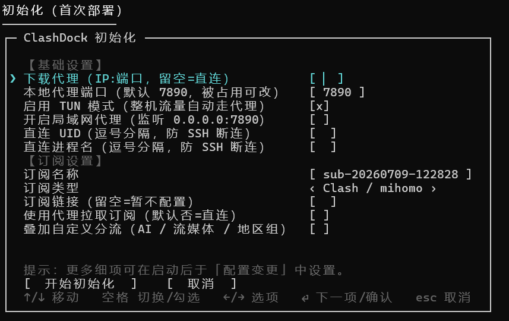
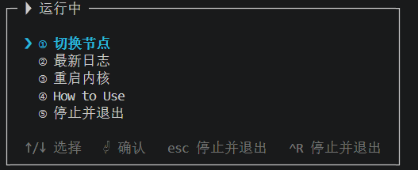
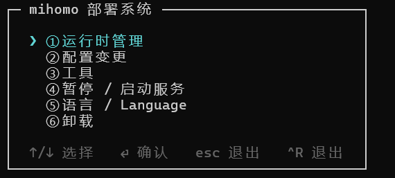
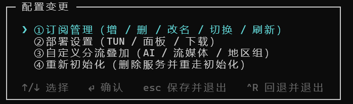
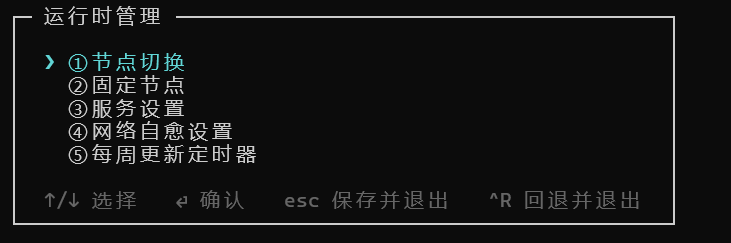
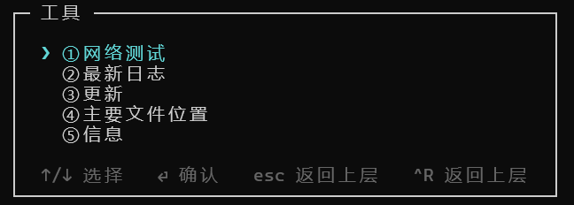

# clashdock

在 Linux 上交互式部署 / 管理 **mihomo（Clash.Meta）** 的终端应用。单个静态二进制，
全流程交互完成：**初始化 / 更改配置 / 暂停启动 / 网络测试 / 卸载**。
> 如果想体验 sing-box 内核，可以参考 [sboxkit](https://github.com/Trilives/sboxkit)

- **直用机场订阅**：mihomo 原生吃 Clash 配置，clashdock **直接消费机场的 Clash/mihomo
  订阅**，只最小改写部署必需字段（端口 / 局域网 / 外部控制器 / TUN / 面板），机场自带的
  策略组与分流规则**全部保留**。自定义分流为**可选叠加**，默认不启用。
- **开箱即用**：.deb 包内置 mihomo 内核与基础规则文件（geosite + IP 库），
  安装后**离线即可启动**；更大的规则数据（geoip.metadb 等）可稍后在线更新。
- **单文件零依赖**：Go 编译的静态二进制，不需要 python3 / curl / 任何运行时。
- **自更新**：主菜单一键把 clashdock 自身更新到最新发行版（校验 SHA-256、原子
  切换版本、失败自动回滚），无需重新走一遍 .deb 安装；稳定版 / 预览版双渠道可选，
  切到预览版后可一键回退到上一个稳定版。
- **TUI 交互**：方向键导航、反显高亮、长提示语自动换行；非 TTY（管道/脚本）
  自动回退编号菜单。
- **随时可中止可回退**：配置类改动包在事务里，**esc 保存退出、^R 回退退出**，
  已应用的改动自动回滚。
- **两种运行方式**：完整模式注册 systemd 系统服务（TUN / 局域网代理 / 防火墙，需要 root
  时自动 `sudo`）；**用户模式**全程免 root，以用户级服务在后台运行纯本机代理（见「安装 · 用户模式」）。

## 预览

首次运行（或检测到服务尚未注册）会先选择语言，再询问是否现在进行初始化；主菜单默认
英文启动，可在「Language / 语言」里切成中文（部分终端无法正常显示中文字符）。初始化用
单屏表单一次性收集基础设置与首个订阅，字段随选择动态显隐。

| 初始化 | 用户模式 |
|:---:|:---:|
|  |  |
| **主菜单** | **配置变更** |
|  |  |
| **运行时管理** | **工具** |
|  |  |

- **配置变更**：订阅管理（增/删/改名/切换/刷新，切换/刷新自动同步并重启服务）、部署设置
  与自定义分流叠加（AI / 流媒体 / 地区组）——两个定制层字段分组直接是平级项。
- **运行时管理**：节点切换 / 固定节点 / 服务设置 / 网络自愈 / 更新定时器，均为即时生效的
  系统操作，各自按需处理重启。
- **工具**：网络测试、最新日志、更新、主要文件位置、信息（代理端口/局域网可达性/TUN/面板
  地址一览）。
- **用户模式**：免 root，mihomo 以用户级服务在后台运行，关闭 clashdock 不影响代理；节点 / 订阅 /
  更新 / 卸载都在同一菜单里围绕这个用户服务完成。

方向键上下移动、⏎ 确认、esc 保存返回、^R 回退返回；每层菜单重入时光标停在上次选中项；
长提示语按终端宽度自动换行；非 TTY（管道/重定向）下自动回退为编号列表 + 文本输入。菜单
选项按常用程度排列（日常操作在前，卸载这类低频/破坏性操作放最后）。

## 安装

### 方式一：.deb（推荐，内置离线种子）

从 [Releases](https://github.com/Trilives/clashdock/releases) 下载对应架构的包，同目录下运行：

```bash
sudo dpkg -i clashdock_*_linux_amd64.deb   # 或 arm64 / armv7
# 也可以使用 sudo apt install ./clashdock_*_linux_amd64.deb
clashdock
```

.deb 内含：`/usr/bin/clashdock`、mihomo 内核（`/usr/libexec/clashdock/mihomo`）、
基础规则种子（`/usr/share/clashdock/ruleset/`）。首次初始化会自动接管这些种子，
无需联网即可注册并启动服务。第三方资产的许可与归属见
`/usr/share/doc/clashdock/copyright`。

### 方式二：用户模式（免 root，用户级服务）

面向**拿不到 root** 的环境（实验室 / 机房 / 受管终端 / 多人共用服务器）：不改系统路径、
不提权，但和完整模式一样由服务在后台常驻，关闭终端、退出 clashdock 都不影响代理。
解压便携包后**直接运行包内的 `./clashdock`**：

```bash
tar -xzf clashdock_*_linux_amd64.tar.gz
cd clashdock_*_linux_amd64
./clashdock            # 用户模式：安装到用户目录并部署用户级服务，不需 root
```

首次运行会：

1. 把本体装到 `~/.local/bin/clashdock`，内核与基础规则接管到 `~/.local/share/clashdock`
   （旧版便携模式放在包目录旁的 `clashdock-data` 会提示迁移），之后便携包目录可删除；
2. 检查本地代理端口 7890 / 控制器端口 9090 是否被占用（多人共用机器很常见），占用时引导改端口；
3. 引导添加订阅，然后注册并启动用户级服务 `clashdock-mihomo.service`（`systemctl --user`），
   可选开启 linger（登出后继续运行、开机自启）。

之后在任意位置运行 `clashdock`（或 `clashdock user`）进入用户模式菜单：节点切换 / 固定节点 /
配置变更 / 启停与重启服务 / 工具（网络测试、最新日志、更新内核 / geo / Web UI / clashdock 自身、
How to Use）/ 卸载。也可以直接 `clashdock pause|resume|update|uninstall`。

用户模式只提供本机纯代理（`127.0.0.1:7890`，端口可改），不开 TUN / 局域网代理 / 防火墙；
需要这些能力时见下方附注改装完整模式。没有 systemd 用户实例的环境（容器、部分 SSH
会话）会自动退化为后台进程：同样不需前台驻留，但不会开机自启，重启后运行一次 `clashdock`
即可。便携包的 `tool/nettest.sh` 可在不启动 clashdock 的情况下自测直连与本机代理。

> **附注：用同一个压缩包装完整模式。** 有 root 又不方便用 .deb 时，解压后运行
> `sudo ./install.sh`：把本体、内核与基础规则装入与 `.deb` **完全一致**的系统路径
> （`/usr/bin`、`/usr/libexec/clashdock`、`/usr/share/clashdock`），之后运行 `clashdock`
> 走方式一的完整模式，离线即可初始化。卸载系统文件用 `sudo ./uninstall.sh`
> （不动 `/var/lib/clashdock` 状态数据）。

### 方式三：源码构建

```bash
git clone https://github.com/Trilives/clashdock.git && cd clashdock
make build && ./clashdock
```

## 使用

**推荐方式：直接运行 `clashdock` 进入交互式终端**——这正是本项目的特点：
部署、订阅、切节点、服务管理全部在方向键菜单里完成，esc 保存返回、^R 回退返回，
无需记忆任何命令。

```bash
clashdock
```

脚本化 / 无人值守场景另有一组子命令（`init` / `modify` / `nettest` /
`pause` / `resume` / `update` / `uninstall` 等），详见
[docs/COMMANDS.md](docs/COMMANDS.md)。

## 功能一览

| 功能 | 说明 |
|---|---|
| 订阅管理 | 多订阅增/删/改名/切换/刷新；添加订阅支持 clash / base64（经 subconverter）/ 本地 YAML 文件三种来源；另有「本地文件覆盖」直接改写当前生效配置（不建订阅条目） |
| 定制层 | 拆成「部署设置」与「自定义分流叠加」两个分组：TUN / 局域网代理 / LAN 面板 / 密钥（脱敏展示）/ 本地代理端口（默认 7890）/ 控制器端口（默认 9090，均可改）/ 下载代理 / GitHub 镜像与 Token / 强制直连端口（默认 22，规避出口封 SSH）/ 主选择组识别关键词（追加）等 |
| 节点切换 | 运行时管理提供「节点切换」与「固定节点」两个独立操作：前者仅 Clash API 热切换不写盘，后者写入配置并同步重启；均支持两级菜单（地区→节点）+ 并发实测延迟，只摘要展示主选择组的当前运行节点或配置首选；未识别主选择组时可当场补充识别关键词，空回车安全取消 |
| 地区聚合组 | 可选生成 SG-Auto / HK-Auto url-test 组，插入主选择组直接选用 |
| 自定义分流叠加 | 可选 AI / 流媒体 / 直连域名 / 直连端口规则叠加（默认关，直用机场分流） |
| clashdock 自更新 | 稳定版 / 预览版双渠道；下载发行版、校验 SHA-256、原子切换版本、试跑校验，失败自动回滚；切到预览版后可一键回退到上一个稳定版 |
| systemd 集成 | 主服务 + 网络自愈 watchdog + 每周更新定时器，统一暂停/启动；Web UI 走 mihomo 内置的 `:9090/ui/` 路径，不再单独占用端口 |
| 网络自愈 | NetworkManager 钩子 + watchdog：断网/漫游后自动恢复，防重启风暴 |
| 用户模式 | 免 root：本体装到 `~/.local/bin`，以 `systemctl --user` 用户级服务后台运行纯本机代理（无 systemd 用户实例时退化为后台进程）；端口占用检测、旧便携数据迁移，更新 / 卸载均围绕用户服务完成 |
| 工具 | 网络测试（流媒体/站点/AI 延迟 + OpenAI/Claude 出口 IP 落地）、最新日志（mihomo 服务日志 + clashdock 应用日志）、更新、主要文件位置一览、信息（代理端口/局域网可达性/TUN/面板地址与密钥状态） |
| 日志 | 可选写入 `<state>/clashdock.log`，超过体量上限自动裁剪保留最新内容 |
| 中英双语 | 默认英文启动（部分终端无法正常显示中文），首次运行检测到服务未注册时会先选语言，主菜单「Language / 语言」也可切中文，持久化到 `customize.json`；`CLASHDOCK_LANG=en\|zh` 可覆盖 |

## 数据目录

运行期所有数据使用**固定工作目录 `/var/lib/clashdock`**（不随用户 / HOME 变化，
root 运行的定时器与用户会话看到同一份数据；首次使用自动经 sudo 创建并交回属主）。
环境变量 `CLASHDOCK_HOME` 可覆盖（主要用于测试）。运行时自包含暂存于
`/var/lib/clashdock-runtime`，systemd 单元名沿用 `mihomo.service` 等。用户模式的数据在
`~/.local/share/clashdock`（遵循 `$XDG_DATA_HOME`），运行时为其下的 `runtime/`，用户级单元为
`~/.config/systemd/user/clashdock-mihomo.service`。

## 目录结构

```
clashdock/
├── cmd/clashdock/          # 入口：子命令分发 + TUI 主菜单
├── internal/
│   ├── tui/                # Bubble Tea 交互组件（select/multiselect/ask/confirm/form）
│   ├── flows/              # 初始化 / 配置变更 / 运行时管理 / 工具 / 卸载 / 节点切换 等流程
│   ├── i18n/               # 中英文界面文案（默认英文，源码中文原文即翻译表 key）
│   ├── subscription/       # 订阅：拉取 / 识别 / 最小改写 / 分流叠加 / 地区聚合组
│   ├── kernel/  fetchx/    # 内核·UI·geo 下载（直连优先→代理兜底）与 deb 种子接管
│   ├── selfupdate/         # clashdock 自更新：版本化目录 + 原子符号链接切换
│   ├── sysd/               # systemd 三组单元（服务/自愈/定时器，模板内嵌）
│   ├── usermode/           # 用户模式：模式判定 + 用户目录布局 + 运行时 + 用户级服务（systemd --user / 后台进程）
│   ├── runtimesvc/         # 服务目标分发：完整模式 → 系统服务，用户模式 → 用户服务
│   ├── config/  txn/  …    # 定制层存取、事务回滚、路径、防火墙、代理环境变量
├── scripts/fetch-deb-deps.sh   # 打包前预下载 mihomo 内核与规则种子
├── scripts/portable/       # 便携包脚本：install.sh / uninstall.sh + tool/nettest.sh
├── packaging/copyright     # 第三方资产许可与归属（.deb 与便携包共用）
└── .goreleaser.yaml        # tar.gz 便携包 + .deb（amd64/arm64/armv7）发布流水线
```

架构与设计细节见 [docs/ARCHITECTURE.md](docs/ARCHITECTURE.md)；后续改动需遵守
[docs/MODULARITY.md](docs/MODULARITY.md)，避免单个文件持续膨胀。

## 许可

clashdock 以 [MIT](LICENSE) 发布。随 .deb 分发的第三方资产：
mihomo（MIT）、geosite.dat（GPL-3.0，MetaCubeX/meta-rules-dat）、
country.mmdb（DB-IP Country Lite，CC BY 4.0 —— *IP Geolocation by
[DB-IP](https://db-ip.com)*）。详见 `packaging/copyright`。
